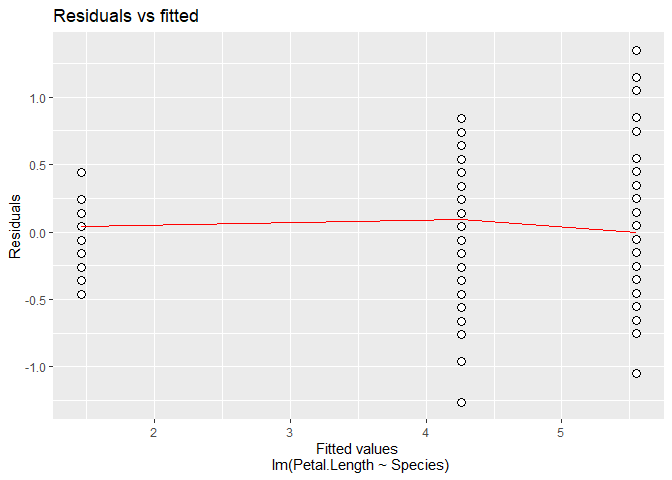

Linear Regression
================
Aydin Ardalan , Seyed Mehdi Mir Shojaei

<!-- README.md is generated from README.Rmd. Please edit that file -->

# LabFour

<!-- badges: start -->

[](https://github.com/aydinardalan/LabFour/actions/workflows/R-CMD-check.yaml)
<!-- badges: end -->

The goal of Lab4 is to create a package using linear algebra formulas to
handle linear regression models. It also made use of object oriented
system to handle special functions such as print(), plot(), resid(),
pred(), coef() and summary(). A vignette is also created on how the
package can be used to conduct a simple regression analysis using a
dataset included in the package. Course information and all assignments
can be found at
<https://www.ida.liu.se/~732A94/info/courseinfo.en.shtml>

## Installation

You can install the development version of LabFour from
[GitHub](https://github.com/) with:

``` r
# install.packages("devtools")
devtools::install_github("aydinardalan/LabFour")
```

## Example

This is a basic example which shows you how to solve a common problem:

``` r
library(LabFour)
mod_object <- linreg$new(formula = Petal.Length ~ Species, data = iris)
mod_object$summary()
#> linreg(formula = Petal.Length ~ Species, data = iris) :
#> 
#>                    Coefficients     Standard error         t values p values    
#> (Intercept)              1.462 0.0608584842239832 24.0229446829347 9.30e-53 ***
#> Speciesversicolor        2.798 0.0860668937750261 32.5095966320547 5.25e-69 ***
#> Speciesvirginica          4.09 0.0860668937750261 47.5211759203373 4.11e-91 ***
#> 
#> 
#> Residual standard error: 0.430334468875131 on 147 degrees of freedom:
mod_object$plot()
#> Warning: `fun.y` is deprecated. Use `fun` instead.
#> `fun.y` is deprecated. Use `fun` instead.
#> [[1]]
```



    #> 
    #> [[2]]


